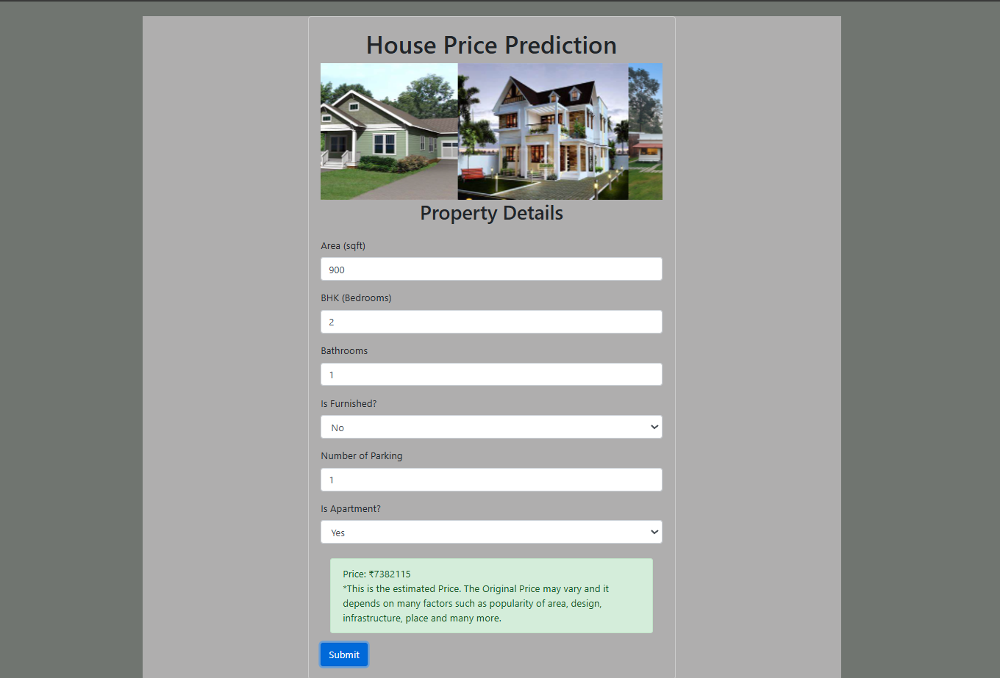
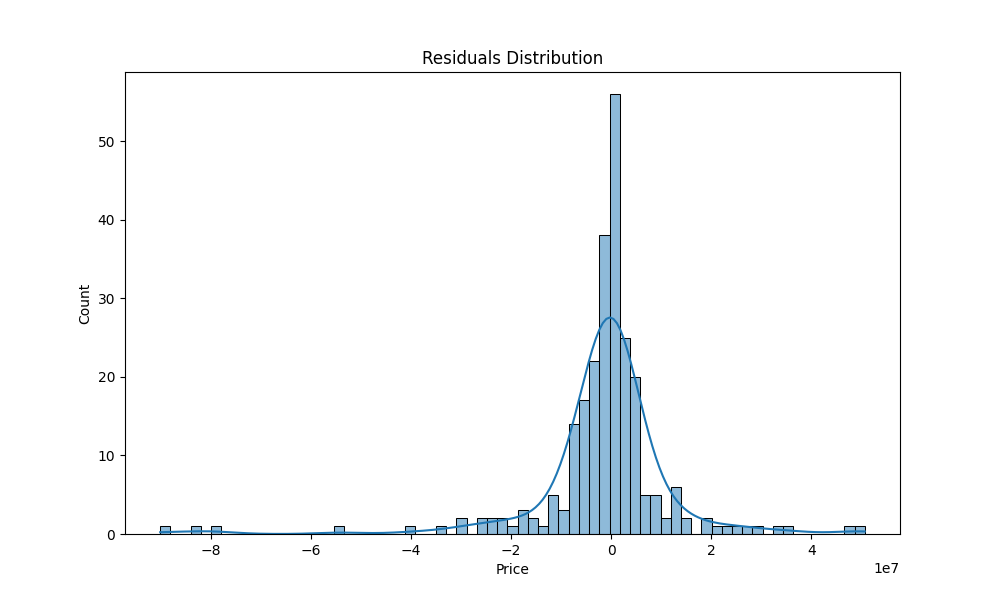

# <font color="violet">House Price Prediction</font>

Welcome to the House Price Prediction project! This project predicts house prices using a Random Forest model implemented in Python. The model is built with the help of various libraries and tools including Scikit-learn, Pandas, NumPy, and more. The project is developed using PyCharm and includes HTML, CSS, and JavaScript files for a web-based user interface.

## ✔️Project Overview

This project leverages a Random Forest model to predict house prices based on features provided in a dataset. The dataset used in this implementation is sourced from Kaggle, but it can be replaced with any other dataset that follows a similar format. The model achieves an R-squared score of approximately 0.73.

## ✔️Features

- **Random Forest Regression Model**: Utilizes a Random Forest algorithm to predict house prices.
- **Web Interface**: Includes HTML, CSS, and JavaScript files for user interaction.
- **Flexible Dataset**: Allows for changing datasets while maintaining similar performance.

### ✔️Prerequisites

- Python 3.x
- Required Python libraries: `pandas`, `numpy`, `scikit-learn`, `flask` (for web interface)


## ✔️Installation

To get started with this project, you'll need to set up your environment and install the required dependencies. Follow the steps below:

**Clone the Repository**

   ```bash
   git clone https://github.com/vinit105/HousePricePrediction.git
   cd house-price-prediction
   ```

## ✔️Project Structure
house-price-prediction(Project)  
│  
├── app.py                       
├── train_model.py              
├── requirements.txt            
├── templates/                   
│   ├── index.html  
│   ├── style.css  
│   └── script.js  
└── README.md                   

## ✔️Outcomes
- Mean Absolute Error (MAE): 7296291.85  
- Mean Squared Error (MSE): 202192022318005.72  
- Root Mean Squared Error (RMSE): 14219424.12  
- R² Score: <span style="background-color:green;">0.73</span>  
- Cross-Validated RMSE: 13088487.70  




## ✔️Contributing
Feel free to contribute to the project by submitting issues or pull requests. Your suggestions and improvements are welcome!

## ✔️Acknowledgments
* Kaggle for providing the dataset.  
* Scikit-learn for the machine learning library.  
* Flask for the web framework.  
